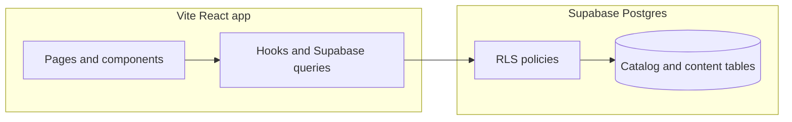

# Architecture

This document maps how the DiamoNY storefront is structured: a single React client on top of one Supabase project, with Row Level Security for public catalog reads and admin writes.

## High-level flow

- **UI**: Routes in [`src/App.tsx`](../src/App.tsx), marketing and catalog pages under [`src/pages/`](../src/pages/), shared UI in [`src/components/`](../src/components/).
- **Admin**: [`src/pages/admin/AdminDashboard.tsx`](../src/pages/admin/AdminDashboard.tsx) with sidebar config in [`src/components/admin/dashboard/AdminSidebar.tsx`](../src/components/admin/dashboard/AdminSidebar.tsx).
- **Brand surface**: Runtime brand fields (name, logo, footer copy, etc.) come from Supabase `brand_settings`, loaded in [`src/contexts/BrandSettingsContext.tsx`](../src/contexts/BrandSettingsContext.tsx). Static defaults and URLs also appear in [`src/lib/siteConfig.ts`](../src/lib/siteConfig.ts).
- **Supabase client**: [`src/integrations/supabase/client.ts`](../src/integrations/supabase/client.ts) — anon key on the storefront; Row Level Security enforces access patterns documented in [`SECURITY_RLS.md`](./SECURITY_RLS.md).

## Feature flags

Central registry: [`src/lib/featureFlags.ts`](../src/lib/featureFlags.ts). Variables use the `VITE_FEATURE_*` prefix. When a variable is **unset**, behavior matches the legacy single-brand site (features stay on).

## Build and deploy

- Vite inlines `import.meta.env` at build time. Any `VITE_*` variable required in production must be present when `npm run build` runs (see [`scripts/cloudways/README.md`](../scripts/cloudways/README.md)).

## Further reading

- [`SECURITY_RLS.md`](./SECURITY_RLS.md) — policies and verification SQL
